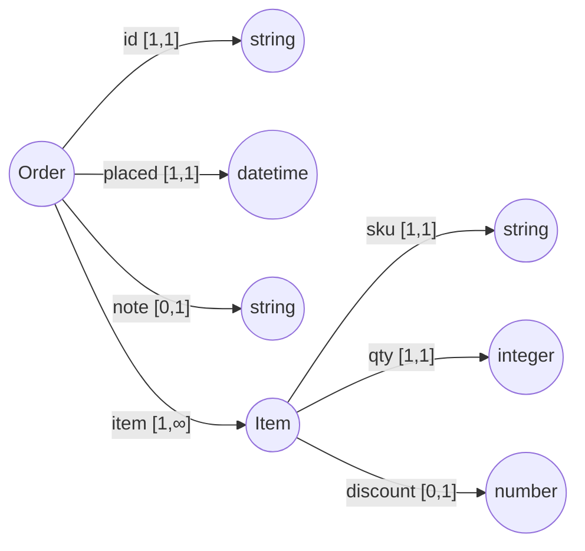

# 3. The Schema model

## 3.1 Mental model

*Non-normative.*

A schema is a graph of named records. Each record lists the labels it allows,
how many times each may appear, and what shape sits at the other end of each
edge.

```
record Order {
    "id":            string,
    "placed":        datetime,
    "note" [0,1]:    string,
    "item" [1,]:     Item,
}
record Item {
    "sku":           string,
    "qty":           integer,
    "discount" [,1]: number,
}
root Order
```

As a graph, `root Order` looks like this. An edge label carries its cardinality;
the node it points to is either a scalar kind or another record.



Four things are worth noticing before the formal rules.

**Every record is closed.** `Order` allows `id`, `placed`, `note`, and `item`,
and nothing else. A stray `shipping` edge is invalid. There is no wildcard.

**Cardinality does all the multiplicity work.** `[1,1]` is required and is the
default when you write no bracket. `[0,1]` is optional. `[1,]` is a non-empty
array. `[,1]` is at most one. There is no array type, because a repeated label
is already the array.

**Records are named and referenced.** There is no inline record body inside a
field. Reuse and recursion then work the same way as every other reference, and
the schema is a graph of named definitions rather than a nested tree.

**A field's type is exactly one thing.** One scalar kind, or one reference, or
`any`. Never a choice between candidates.

That last point is worth dwelling on, because it is the constraint that shapes
the whole model.

---

## 3.2 What this model refuses, and why

Omnist does not support structural unions (`{a} | {b}`), value enums
(`"red" | "green"`), or open/wildcard maps (`{ [string]: T }`). These are
refusals, not omissions awaiting a future release.

The reason is one sentence, and it is the same reason in all three cases:

> **The moment a value can match more than one candidate, there is no
> principled way to decide what it really is.**

Follow it through. If a field could be "an integer or the literal string
`unlimited`", then when a reader materializes a value it must pick a type, and a
value that matches both candidates — or neither cleanly — leaves it guessing.
If a record could be `{a} | {b}`, then a node matching both admits two different
answers to "which record is this," and every operation downstream inherits the
ambiguity. If a record has an open key set, the label alphabet the algebra
reasons over is no longer finite, and `compatible_with`, `normalize`, and
`extract` stop being decidable.

The rest of this specification does not repeat this argument. Where a refusal
appears below, this is the reason.

The single sanctioned opening is `any` (§3.7), which is designed to not create
this problem: it opens a value, never a label alphabet, and it is written
literally in the schema text so it can be found by grep and audited by a human.

---

## 3.3 Formal definition

```
Schema      = (root: Ref, env: Name -> Record)

Record      = { Field, ... }                    ; CLOSED: only these labels
Field       = (label: String, type: Type, cardinality: [min, max])
Type        = Scalar | Ref | Any
Scalar      = (kind, nullable: Boolean)
              kind in { string, integer, number, boolean, date, time, datetime }
Ref         = Name                              ; resolved in env
Any         = the singleton `any` type
min         = non-negative integer
max         = non-negative integer | unbounded
```

Constraints on a well-formed schema:

- **S-1.** Exactly one root MUST be declared. The root MUST be a `Ref`, never a
  scalar and never `any`.
- **S-2.** `min` MUST be a non-negative integer. `max`, when bounded, MUST be a
  non-negative integer with `max >= min`. A negative bound or an inverted range
  is an error.
- **S-3.** A record name MUST NOT be one of the seven scalar kind keywords, and
  MUST NOT be `any`. Type position resolves a bare name to a builtin first, so
  such a record could never be referenced.
- **S-4.** A record name MUST be unique within `env`.
- **S-5.** A field's label MUST be unique within its record. Two fields naming
  the same label is an error, not an implicit merge.
- **S-6.** A `Ref` MUST resolve to a name present in `env`. Forward references
  and mutual recursion are legal; a dangling reference is an error.
- **S-7.** `nullable` MAY be set only on a `Scalar`. A nullable `Ref` and a
  nullable `any` are both errors.

A schema MAY be recursive. `env` is finite, so every operation in
[chapter 6](06-schema-algebra.md) terminates.

---

## 3.4 Cardinality

Cardinality is a closed integer range `[min, max]` where `max` may be unbounded.
It bounds the **count** of edges carrying the field's label in a node. It says
nothing about their positions.

The OSD surface forms:

| Written | min | max | Meaning |
|---|---|---|---|
| *(omitted)* | 1 | 1 | Exactly one. The default. |
| `[n]` | n | n | Exactly n |
| `[m,n]` | m | n | Between m and n inclusive |
| `[m,]` | m | unbounded | At least m |
| `[,n]` | 0 | n | At most n |
| `[,]` | 0 | unbounded | Any count, including zero |
| `[]` | — | — | **Error.** Empty cardinality. |

Common cases in the shorthand above: `[1,1]` required, `[0,1]` optional,
`[0,]` array, `[1,]` non-empty array, `[2,5]` bounded array.

The grammar in [chapter 5](05-osd-grammar.md) accepts every row of this table
except the last, which it rejects with a specific error. In particular the
comma-first forms `[,n]` and `[,]` are legal: a minimum bound before the comma
is not required.

A field with `max = 0` is legal to write and means the label may never appear.
`prune` removes such fields (§6.5).

---

## 3.5 Nullable versus optional

These are different questions and they use different mechanisms. Conflating
them is the most common modeling error in Omnist.

| Question | Mechanism | Written |
|---|---|---|
| May the edge be missing? | cardinality `min = 0` | `"note" [0,1]: string` |
| May the value present be `null`? | nullable scalar | `"note": string?` |
| Both? | both | `"note" [0,1]: string?` |

`?` applies to scalars only. A reference MUST NOT take `?`; "this subtree may be
absent" is cardinality `[0,1]`. `any` MUST NOT take `?` either, since `any`
already admits `null`.

> A record-or-null field would need a type that is half scalar and half
> reference. The model has no such type, by §3.2.

---

## 3.6 Validation

A node `n` conforms to a record `R` in schema `S` if and only if all three hold.

1. **Cardinality.** For every field `(label, type, [min, max])` in `R`, let `c`
   be the number of edges in `n` whose label equals `label`. Then
   `c >= min`, and if `max` is bounded, `c <= max`.
2. **Closedness.** Every edge label in `n` is the label of some field of `R`.
3. **Targets.** For every edge in `n`, its target conforms to the type of the
   field whose label it matches.

A target conforms to a type as follows:

- to `Scalar(kind, nullable)`: the target is a value whose kind is `kind`, or
  the target is `null` and `nullable` is true. A node never conforms to a
  scalar.
- to `Ref(name)`: the target is a node conforming to `env[name]`. A value never
  conforms to a reference.
- to `any`: always. Descent stops; nothing below is checked.

A Document conforms to a schema `S` if its root node conforms to `env[S.root]`.

**Order MUST be ignored** at every step (invariant D-3). Validation counts
edges; it never sequences them.

**Validation checks, it never converts.** A value either has the declared kind
or it does not. Converting a value to match a declared type is materialization,
a separate operation defined in
[chapter 7](07-codecs-and-deserialization.md).

**Validation MUST report every failure**, not just the first. A validation
result is a list of `(path, code, message)` entries; an empty list means valid.
Codes are defined in [chapter 8](08-conformance-and-errors.md).

---

## 3.7 The `any` type

`any` is the model's one sanctioned opening. It accepts every legal Document
value: any scalar of any kind, `null`, and any node of any shape.

Its scope is deliberately narrow.

**What `any` opens.** The value at one declared field, and everything beneath
it.

**What `any` does not open.** The record's label alphabet. A field typed `any`
still has a label and still has a cardinality; the record remains closed. Adding
an `any` field does not let unknown labels through anywhere.

Semantics of `any` in each operation:

| Operation | Behavior at an `any` boundary |
|---|---|
| validate | Descent stops. The subtree is accepted unchecked. |
| `compatible_with` | If the right-hand type is `any`, the answer is true — `any` absorbs everything. If the left-hand type is `any` and the right-hand type is not, the answer is false. |
| materialize | The subtree passes through untouched. No leaf upgrades happen inside it. |
| `infer` | `infer` MUST NOT emit `any` unless explicitly requested. When requested, every opening it introduces MUST be reported. |
| `lint` | Every `any` field is reported as an informational finding, so a human can audit the schema's openings. |

Restrictions:

- `any?` MUST be rejected. `any` already includes `null`.
- A record MUST NOT be named `any`.
- Only the exact lowercase spelling is reserved. `Any` is an ordinary name and
  therefore a reference.
- Cardinality is orthogonal to `any`: `"data" [0,]: any` is legal.

> The cost of `any` is stated plainly in §6.2: compatibility checking is
> vacuous inside an `any` boundary, so a change made beneath one is invisible to
> `compatible_with`. That is the trade the escape hatch buys, and it is why
> `lint` inventories every occurrence.
