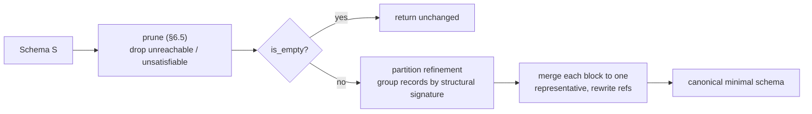

# 6. The Schema Algebra

## 6.1 Where this comes from, and what changed

The operations in this chapter descend from Lee and Cheung, *XML Schema
Computations* (CIKM 2010), which models a schema as a **schema automaton** and
derives algorithms over it: `MakeUsefulSA` (useless-state removal), `MinimizeSA`
(partition-refinement minimization), `SubschemaSA` (language inclusion), and
`ExtractSubschema`. Omnist keeps the algorithms and their proof obligations. It
changes the object they operate on, in four specific ways. A reader who knows
the paper should be able to check off exactly these and nothing else.

**Generalization: the model is format-agnostic, not XML-only.** The paper's
automaton reads XML elements. Omnist's operates over the Document model of
[chapter 2](02-document-model.md), which JSON, YAML, TOML, XML, and OML all read
into. The algorithms did not need to change for this. What it buys is that a
compatibility answer computed on a schema is valid regardless of which format
the documents arrive in.

**Simplification: cardinality ranges replace regular child-sequence languages.**
The paper constrains a state's children by a regular language over the label
alphabet, which admits order and arbitrary sequencing. Omnist constrains each
label by a count range `[min, max]`, and ignores order entirely. This is
strictly less expressive. The gain is threefold: inclusion between two count
ranges is an integer comparison rather than a regular-language containment test,
schemas stay human-writable, and validation results become order-independent,
which is what lets an XML document and a reordered JSON document validate
identically.

**Simplification: a named record graph replaces anonymous automaton states.**
The paper's states are anonymous and identified structurally. Omnist's records
have names, and every reference is by name. Recursion and reuse become the same
mechanism. The practical consequence is that `normalize`'s output is a schema an
author can read and diff, not an automaton they must decompile — minimization
merges names rather than renumbering states.

**Simplification: seven fixed scalar kinds replace an open value domain.** The
paper leaves the leaf value domain open. Omnist fixes it at seven kinds, with
exactly one subtyping relation between them (§6.3). A closed, tiny lattice is
what makes scalar inclusion a table lookup and keeps schema-directed
materialization unambiguous.

One further discipline is inherited rather than modified: the paper's refusal to
add flexibility that costs decidability. Omnist's version of that refusal — no
unions, no enums, no open maps — is stated once, with its reason, in
[§3.2](03-schema-model.md#32-what-this-model-refuses-and-why).

**Where `any` fits.** `any` (v0.5.0) is not in the paper. It is a top type at a
declared field. Every operation below halts its descent at an `any` boundary.
That halting is what keeps decidability intact, and it is also the feature's
cost: nothing beneath an `any` is compared, so nothing beneath it is protected.

---

## 6.2 Notation used in the pseudocode

```
S.root                 the schema's root Ref
S.env[name]            the record bound to `name`
S.resolve(t)           t if t is a Scalar or Any; S.env[t.name] if t is a Ref
R.fields               the record's fields, in declaration order
R.field(label)         the field with that label, or none
f.min, f.max           cardinality; f.max may be unbounded
le(x, y)               x <= y, with unbounded treated as +infinity
```

`le` is used wherever a maximum is compared, and is normative:

```
function le(x, y):
    if y is unbounded: return true
    if x is unbounded: return false
    return x <= y
```

---

## 6.3 Scalar subtyping

There is exactly **one** subtyping relation between scalar kinds:

> `integer` is a subtype of `number`. Nothing else.

Formally, `Scalar(ka, na)` is a subtype of `Scalar(kb, nb)` when:

```
function scalar_sub(a, b):
    if a.nullable and not b.nullable: return false
    if a.kind == b.kind: return true
    return a.kind == "integer" and b.kind == "number"
```

`date` is not a subtype of `datetime`. `string` is not a supertype of anything.
Implementations MUST NOT add relations; each one added changes every
compatibility answer in the system.

---

## 6.4 `is_empty(S)` and satisfiability

A record is **satisfiable** if at least one finite Document can match it. A
record with a mandatory field pointing at an unsatisfiable record is itself
unsatisfiable — most commonly, a required reference cycle.

```osd
record Node { "child": Node }   # every document would be infinite
root Node
```

`satisfiable_set` is a least fixpoint. Start with nothing known satisfiable, and
repeatedly add any record whose mandatory fields are all satisfiable. `env` is
finite and the set only grows, so this terminates.

```
function satisfiable_set(S):
    sat = {}
    repeat until no change:
        for (name, rec) in S.env:
            if name in sat: continue
            if record_satisfiable(rec, sat):
                add name to sat
    return sat

function record_satisfiable(rec, sat):
    for f in rec.fields:
        if f.min < 1: continue              # optional never blocks
        if f.type is Scalar or Any: continue
        if f.type.name not in sat: return false
    return true

function is_empty(S):
    return S.root.name not in satisfiable_set(S)
```

Note that `any` is treated as satisfiable, since it admits every value.

Iteration over `env` MUST be deterministic. `env` is ordered by declaration;
implementations MUST NOT iterate an unordered set where the result's ordering is
observable.

---

## 6.5 `prune(S)`

`prune` returns a schema equivalent to `S` with everything that can never match
removed. It is a normalization step, not a semantic change: `prune(S)` and `S`
accept exactly the same Documents.

What it removes:

- records unreachable from the root by following references;
- fields with `max == 0`, which can never be emitted;
- optional fields (`min == 0`) whose type is an unsatisfiable record, which can
  never be emitted either;
- records left unreachable after the above.

**The root-unsatisfiable case is special and is normative.** If the root record
is itself unsatisfiable, field pruning MUST NOT be applied to the root. Its
mandatory fields are exactly what make it unsatisfiable; stripping them would
produce a different, satisfiable schema, breaking the guarantee that `prune`
preserves the language. Instead the root is kept as written, and only the rest
of the environment is reduced to what is reachable from it.

```
function prune(S):
    sat     = satisfiable_set(S)
    root_ok = S.root.name in sat
    keep    = reachable(S, sat, root_ok)

    new_env = ordered map
    for name in S.env (in declaration order):
        if name not in keep: continue
        if not root_ok and name == S.root.name:
            new_env[name] = S.env[name]          # keep the bad root intact
        else:
            new_env[name] = prune_record(S.env[name], sat)
    return Schema(Ref(S.root.name), new_env)

function prune_record(rec, sat):
    kept = []
    for f in rec.fields:
        if f.max == 0: continue
        if f.min == 0 and f.type is Ref and f.type.name not in sat: continue
        append f to kept
    return Record(kept)
```

`reachable` walks from the root following references through fields that
survive `prune_record` — except at an unsatisfiable root, where every field is
followed.

**Determinism requirement.** The output environment's key order MUST be derived
by iterating `S.env` in declaration order and filtering by the reachable set,
never by iterating the reachable set. Iterating an unordered set makes the
output order depend on hash seeding, which makes canonical output
non-reproducible across runs. This has bitten a real implementation; it is a
conformance requirement, not a style note.

---

## 6.6 `compatible_with(A, B)`

**Meaning.** True when every Document `A` accepts is also accepted by `B`. In
release terms: `A` is the new schema, `B` is the old one, and true means the
change is backward-compatible for readers holding `B`.

**Worked example.**

Schema `A`:

```osd
record User {
    "id":         string,
    "name":       string,
    "nick" [0,1]: string,
}
root User
```

Schema `B`:

```osd
record User {
    "id":   string,
    "name": string,
}
root User
```

`compatible_with(A, B)` is **false**: `A` may emit a `nick` edge, and `B` is
closed with no such field. Reverse the arguments and `compatible_with(B, A)` is
**true**: everything `B` emits, `A` accepts, and `A`'s extra field is optional
so `A` requires nothing `B` fails to supply.

Adding an optional field is safe for *readers of the new schema*, and unsafe for
*readers of the old*. The direction of the call is the whole question.

**Algorithm.** This is the paper's Algorithm 4, restricted to counting
cardinality languages. Algorithm 4 assumes `MakeUsefulSA` has already run: the
coinductive cycle rule below only coincides with real language inclusion once
every A-side record is known satisfiable. Rather than requiring callers to prune
first, `compatible_with` computes `A`'s satisfiable set once up front and
consults it directly. An unsatisfiable A-side record is vacuously a subschema of
anything, since it emits no documents at all.

Recursive schemas are handled by **coinduction**: on entering a pair of records
already on the stack, assume true, then let the surrounding checks refute it.
Memoization on the resolved-definition pair makes this terminate.

```
function compatible_with(A, B):
    sat_a = satisfiable_set(A)
    return sub(A, A.root, B, B.root, sat_a, memo = {})

function sub(SA, ta, SB, tb, sat_a, memo):
    if ta is Ref and ta.name not in sat_a:
        return true                       # vacuous: A emits nothing here
    da = SA.resolve(ta)
    db = SB.resolve(tb)
    key = (identity of da, identity of db)
    if key in memo: return memo[key]
    memo[key] = true                      # coinductive assumption

    if db is Any:                result = true       # any absorbs all
    else if da is Any:           result = false      # only any holds any
    else if da,db both Scalar:   result = scalar_sub(da, db)
    else if da,db both Record:   result = record_sub(SA, da, SB, db, sat_a, memo)
    else:                        result = false      # value versus object

    memo[key] = result
    return result

function record_sub(SA, a, SB, b, sat_a, memo):
    # 1. Every label A may emit must be allowed by B.
    for fa in a.fields:
        if fa.max == 0: continue                     # A never emits it
        if fa.min == 0 and fa.type is Ref and fa.type.name not in sat_a:
            continue                                 # A never emits it either
        fb = b.field(fa.label)
        if fb is none: return false                  # B is closed
        if not (fb.min <= fa.min and le(fa.max, fb.max)): return false
        if not sub(SA, fa.type, SB, fb.type, sat_a, memo): return false

    # 2. Every label B requires must be guaranteed by A.
    for fb in b.fields:
        if fb.min >= 1:
            fa = a.field(fb.label)
            if fa is none or fa.min < fb.min: return false
    return true
```

The memo key MUST be the identity of the *resolved definitions*, not the
reference names. Two names bound to the same record definition are the same
node in the graph, and keying on names would defeat cycle detection where
aliasing is present.

**The `any` blind spot.** By the two `Any` clauses above, `compatible_with` is
vacuously true inside a right-hand `any`. If `B` declares a field `any` and `A`
restructures everything beneath it, the answer is still true. That is correct —
`B` really does accept it — and it is also a real loss of protection. This is
the cost `any` buys, and it is why `lint` reports every `any` field.

---

## 6.7 `equivalent(A, B)`

Two schemas are equivalent when they accept exactly the same set of Documents.

```
function equivalent(A, B):
    return compatible_with(A, B) and compatible_with(B, A)
```

There is no cheaper structural shortcut, and implementations MUST NOT
substitute one. Structural equality is strictly stronger than equivalence: two
schemas can differ in record names, declaration order, and the presence of
unreachable records while accepting exactly the same documents.

---

## 6.8 `normalize(S)`

`normalize` returns the canonical minimal schema equivalent to `S`: the fewest
records, unique up to record naming. This is the paper's `MinimizeSA`.

Three steps.



1. **Prune** (§6.5). If the result is empty (`is_empty`), return it unchanged —
   `prune` deliberately leaves an unsatisfiable root's fields alone, so there is
   no "fewest records" question to answer for a schema that accepts nothing.
2. **Partition refinement.** Group record names into structural equivalence
   classes. Start from a local signature — each record's fields as
   `(label, min, max, is-scalar-or-not)`, target-blind. Then refine to a
   fixpoint: two records stay in the same block only if, for every field, their
   reference targets are in the same block.
3. **Merge.** Pick one representative per block (the lexicographically smallest
   name, so the choice is deterministic), rewrite every reference to it, and
   drop the rest.

```
function equivalence_classes(S):
    names    = sorted(S.env keys)
    blocks   = group_by(names, name -> local_signature(S.env[name]))
    block_of = index of each name's block
    repeat until the block count stops changing:
        new_blocks = []
        for block in blocks:
            for sub in group_by(block, name -> refine_key(S.env[name], block_of)):
                append sub to new_blocks
        blocks   = new_blocks
        block_of = reindex(new_blocks)
    return blocks

function refine_key(rec, block_of):
    fields = sorted by label of
        (f.label, f.min, f.max,
         block_of[f.type.name] if f.type is Ref else none)
        for f in rec.fields
    return (local_signature(rec), fields)

function normalize(S):
    S = prune(S)
    if is_empty(S): return S
    rep = {}
    for block in equivalence_classes(S):
        keep = min(block)                  # lexicographic; deterministic
        for n in block: rep[n] = keep
    new_env = { name: remap(S.env[name], rep)
                for name in sorted(S.env keys) if rep[name] == name }
    return Schema(Ref(rep[S.root.name]), new_env)
```

Names MUST be sorted before grouping, and the representative MUST be the
minimum of its block. Both requirements exist so that two implementations
produce the same canonical output, not merely equivalent output.

`equivalence_classes` operates on `S.env` exactly as given. It does **not**
prune first. `normalize` prunes before calling it; `lint` calls it on the raw
schema so that duplicates are reported as the author wrote them.

**Worked example.**

```osd
record A { "x": string }
record B { "x": string }
record Top { "a": A, "b": B }
root Top
```

`A` and `B` have identical local signatures and no reference fields, so they
merge on the first pass. `normalize` returns:

```osd
record A { "x": string }
record Top { "a": A, "b": A }
root Top
```

---

## 6.9 `extract(S, keep)`

Given a set of permissible labels, `extract` returns the minimal subschema that
recognizes only Documents built from those labels. This is the paper's
`ExtractSubschema`; its headline application there was trimming a large shared
industry schema down to what one document type actually needs.

Steps:

1. For every record, delete any field whose label is not in `keep`.
2. If a deleted field was mandatory (`min >= 1`), that record is **invalidated**.
   No document can be built at that record's shape without a label that is no
   longer available.
3. Propagate. A record with a mandatory field typed to an invalidated record is
   itself invalidated. Least fixpoint, same shape as §6.4.
4. If the root is invalidated, there is no valid subschema for this `keep` set.
   `extract` MUST fail with an error naming the first offending label and
   record, so the failure is actionable.
5. Otherwise run the result through `prune` and then `normalize`, landing in the
   same canonical form `normalize` produces everywhere else.

**Deleting a mandatory field is an error, not a silent relaxation.** An
implementation MUST NOT relax the deleted field to optional instead. Doing so
would make `extract` return a schema weaker than the input rather than a
subschema of it, and it would hide what is far more often a mistake in the
caller's `keep` set than an intended change. A caller who wants the relaxed
behavior can edit cardinalities before calling `extract`.

```
function extract(S, keep):
    trimmed     = {}                        # name -> Record, fields filtered
    invalidated = {}                        # set of record names
    first_bad   = none                      # (label, record_name), for the error message

    for (name, rec) in S.env:               # step 1 + 2
        kept = []
        for f in rec.fields:
            if f.label in keep:
                append f to kept
            else if f.min >= 1:
                if first_bad is none: first_bad = (f.label, name)
                add name to invalidated
        trimmed[name] = Record(kept)

    repeat until no change:                 # step 3: propagate, least fixpoint
        for (name, rec) in trimmed:
            if name in invalidated: continue
            for f in rec.fields:
                if f.min >= 1 and f.type is Ref and f.type.name in invalidated:
                    add name to invalidated
                    break

    if S.root.name in invalidated:          # step 4
        (label, record_name) = first_bad
        fail: "removing label " + label + " deletes a mandatory field of " + record_name

    new_env = {}                            # step 5: drop invalidated records and
    for (name, rec) in trimmed:              # any field (mandatory or not) still
        if name in invalidated: continue     # pointing at one
        fields = [f for f in rec.fields
                  if not (f.type is Ref and f.type.name in invalidated)]
        new_env[name] = Record(fields)

    return normalize(prune(Schema(Ref(S.root.name), new_env)))
```

`first_bad` records the *first* offender encountered during step 1's single
pass over `S.env` in declaration order — not the first one propagation later
discovers. Implementations MUST report this one specifically, so that two
implementations facing the same input produce the same error message.

**Worked example.** With the `Root`/`Order`/`Address`/`LineItem` schema from
[§3.1](03-schema-model.md#31-mental-model):

- `extract(S, {"order", "id", "status", "total", "address", "street", "city",
  "items", "sku", "qty", "price"})` succeeds and returns a schema with `coupon`
  gone. `coupon` is optional, so dropping it invalidates nothing.
- `extract(S, {"order", "id", "status"})` fails: `Order.total`, `Order.address`,
  and `Order.items` are all mandatory and none of their labels is in `keep`, so
  `Order` is invalidated. Per `first_bad`'s declaration-order rule above, the
  reported offender is specifically `total` — it's declared before `address`
  and `items` in the record, so step 1's single pass reaches it first.
  `Root.order` is mandatory and points at `Order`, so `Root` — the root — is
  invalidated in turn.

---

## 6.10 `infer(samples)`

`infer` drafts a schema that accepts a set of sample Documents. It is a
convenience for getting started, not part of the algebra's decidability story,
and its output is expected to be edited by a human.

Rules:

- A label present in every sample exactly once becomes `[1,1]`.
- A label absent from some samples becomes `[0,1]`.
- **A label seen more than once in any sample becomes `[0,]`** — cardinality
  `min = 0`, not the observed minimum count. `infer` is permissive on array
  length by design: it drafts a schema loose enough that a plausible sixth
  sample with a shorter (or empty) array wouldn't need hand-editing just to
  keep passing. Do not infer `min` from the smallest count seen; that is a
  common and wrong assumption to carry over from validating a fixed sample set.
- Scalar children become one scalar kind, nullable if any sample was `null`.
- Samples disagreeing on scalar kind are an error, with one exception:
  `integer` mixed with `number` collapses to `number`. That exception exists
  because it is the one subtyping relation the model has (§6.3).
- Node children become nested named records, recursively. Since the model has
  no inline records, generated names are derived from the label and MUST be
  made unique.

```
function infer(samples, root_name = "Root"):
    if samples is empty: fail: "cannot infer a schema from zero samples"
    for s in samples:
        if s is not a node: fail: "infer expects object (record) samples at the root"
    env = {}
    used = {}                                # names already assigned, for uniqueness
    infer_record(samples, root_name, env, used)
    return Schema(Ref(root_name), env)        # NOT normalized -- see below

function infer_record(nodes, name, env, used):
    add name to used
    # Pass 1: collect every label that appears in ANY sample, in first-seen
    # order across samples. Pass 2: for every sample, count every label from
    # pass 1, defaulting to 0 if absent. Two passes, not one, so a label
    # missing from sample 1 but present in sample 5 still comes out [0,1] --
    # the result must not depend on which sample happens to be examined first.
    order = []
    for node in nodes:
        for (label, _) in node.edges:
            if label not seen before: append label to order

    children = { label: [] for label in order }        # label -> list of child values
    per_sample_counts = { label: [] for label in order } # label -> list of one count per sample
    for node in nodes:
        counts_here = {}
        for (label, child) in node.edges:
            append child to children[label]
            counts_here[label] = counts_here.get(label, 0) + 1
        for label in order:
            append counts_here.get(label, 0) to per_sample_counts[label]

    fields = []
    for label in order:
        counts = per_sample_counts[label]
        if max(counts) > 1:
            cmin, cmax = 0, unbounded          # array: permissive, see rule above
        else:
            cmin, cmax = min(counts), 1        # 0 or 1 across samples -> optional/required
        typ = infer_type(children[label], label, name, env, used)
        append Field(label, typ, cmin, cmax) to fields
    env[name] = Record(fields)

function infer_type(child_values, label, record_name, env, used):
    if all child_values are nodes:
        rec_name = unique_name_from(label, used)
        infer_record(child_values, rec_name, env, used)
        return Ref(rec_name)
    if some but not all child_values are nodes:
        fail: "label " + label + " mixes objects and values; cannot infer one type"
        # (or, in an allow_any mode: return Any, and report the opening -- see below)
    kinds = {}
    saw_null = false
    for v in child_values:
        if v is null: saw_null = true
        else: add value_kind(v) to kinds
    if "number" in kinds: remove "integer" from kinds   # the one subtype relation, §6.3
    if kinds is empty: return Scalar("string", nullable = saw_null)  # no non-null sample
    if size(kinds) > 1:
        fail: "label " + label + " has values of more than one scalar kind"
        # (or, in an allow_any mode: return Any, and report the opening -- see below)
    return Scalar(the one kind in kinds, nullable = saw_null)
```

Two requirements:

**`infer` MUST NOT normalize its output.** The raw result keeps a one-to-one
correspondence between sample labels and generated record names, which is what
makes it readable and hand-editable. It may therefore contain structurally
identical duplicate records. A caller who wants the canonical form calls
`normalize` explicitly.

**`infer` MUST NOT emit `any` by default.** Opening a field is a decision the
author makes, never one the tool makes for them. An implementation MAY offer an
opt-in mode; when it does, it MUST report every opening it introduced, with a
location and a reason.

Samples MUST be node-rooted. Inferring from a bare scalar, or from zero
samples, is an error.

---

## 6.11 `lint(S)`

`lint` diagnoses the schema itself. `validate` checks a document against a
schema; `lint` checks a schema for structures that parse fine but can never do
anything.

**`lint` reports and MUST NOT mutate.** That line is the whole design. `prune`
and `normalize` are the transforms that fix these problems; `lint` only names
them.

| Finding | Severity | Meaning |
|---|---|---|
| `unsatisfiable-record` | warning | A record reachable from the root that no finite Document can match. |
| `unreachable-record` | warning | A record defined in `env` but not reachable from the root by any reference. |
| `duplicate-record` | warning | One finding per oversized equivalence-class block, naming every record in it. Not one finding per record name. |
| `any-field` | info | An inventory entry for every `any`-typed field, so a human can audit the schema's openings. |

Computation:

- `unsatisfiable-record` is the reachable set minus the satisfiable set.
- `unreachable-record` uses a plain reachability walk that follows **every**
  reference-typed field regardless of cardinality. A record reachable only
  through an optional or unsatisfiable field still counts as referenced. This is
  deliberately different from `prune`'s reachability, which is language-aware.
- `duplicate-record` uses `equivalence_classes` on the **raw** schema, so
  duplicates are reported as authored rather than after pruning. **One finding
  per block, not one per name.** The block's names, sorted, are joined into a
  single `location` string (`"Addr, Location"`); the message names every
  member relative to the sorted-minimum representative. This was corrected
  after a Rust-implementation audit found the previous edition of this
  pseudocode specified one-finding-per-name — that specification never
  matched the reference implementation (Python's `ops/lint.py` has always
  emitted one joined finding per block), so the earlier text was the actual
  bug, not the implementations that disagreed with it.
- `any-field` is advisory. It MUST NOT on its own cause a non-zero exit status
  in a command-line tool.

Findings MUST be sorted deterministically by `(code, location)`.

```
function lint(S):
    findings  = []
    reach     = reachable(S)              # plain walk, defined below -- not prune's walk
    sat       = satisfiable_set(S)         # §6.4

    for name in (reach - sat):
        add Finding("unsatisfiable-record", "warning", name) to findings

    for name in (S.env.keys - reach):
        add Finding("unreachable-record", "warning", name) to findings

    for block in equivalence_classes(S):   # §6.8, run on S as authored -- not pruned first
        if size(block) > 1:
            group = sort(block)                      # deterministic representative choice
            location = join(group, ", ")              # ONE finding per block, not per name
            keep = group[0]
            others = join([name for name in group[1:]], ", ")
            add Finding("duplicate-record", "warning", location) to findings
            # message names every other member relative to `keep`, the
            # sorted-minimum representative -- e.g. "records 'B', 'C' are
            # structurally identical to 'A'; merge them with normalize"

    for (name, rec) in S.env:
        for f in rec.fields:
            if f.type is Any:
                add Finding("any-field", "info", name + "." + f.label) to findings

    sort findings by (code, location)
    return findings

function reachable(S):
    seen  = {}
    stack = [S.root.name]
    while stack is not empty:
        name = pop stack
        if name in seen or name not in S.env: continue
        add name to seen
        for f in S.env[name].fields:
            if f.type is Ref: push f.type.name to stack
    return seen
```

`reachable` here is deliberately not `prune`'s reachability. It follows every
`Ref`-typed field regardless of cardinality or satisfiability — a record
reached only through an optional field, or only through a field whose target
turns out unsatisfiable, still counts as referenced for `lint`'s purposes. This
is why `unsatisfiable-record` and `unreachable-record` can each fire on records
`prune` would have handled differently: `lint` reports the schema exactly as
authored, `prune` transforms it.

---

## 6.12 Termination

Every operation above terminates on every well-formed schema, including
recursive ones.

| Operation | Why it terminates |
|---|---|
| `satisfiable_set`, `is_empty` | Monotone least fixpoint over a finite `env`. |
| `prune` | One fixpoint plus one bounded walk. |
| `compatible_with`, `equivalent` | Memoized over pairs of resolved definitions; finitely many pairs. Coinductive assumption breaks cycles. |
| `normalize` | Partition refinement strictly increases block count, bounded by the number of records. |
| `extract` | Least fixpoint, then `prune` and `normalize`. |
| `lint` | Reachability walk plus `satisfiable_set` plus `equivalence_classes`. |
| `infer` | Bounded by the size of the samples, themselves bounded by §2.4. |

This table is the payoff for every refusal in
[§3.2](03-schema-model.md#32-what-this-model-refuses-and-why). Adding unions,
enums, or open key sets removes rows from it.
