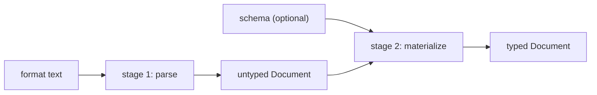

# 7. Codecs and deserialization

## 7.1 Two stages

Reading a document is two separate operations, and keeping them separate is
normative.



**Stage 1: parse.** Turn format text into a Document. No schema is involved. The
result carries whatever types the format itself distinguishes — JSON has no date
type, so an ISO-8601 date arrives as a string. Stage 1 MUST be total with
respect to the schema: it never consults one and never fails because of one.

**Stage 2: materialize.** Walk the untyped Document together with a schema,
upgrading leaves to the declared types, and check record shape in the same pass.

Stage 2 is optional. With no schema, the Document is returned exactly as read,
untouched. There is no third mode. Implementations MUST NOT offer a `strict`
switch: either a schema is supplied and the result is guaranteed to conform, or
one is not and nothing is checked.

## 7.2 Materialization rules

Materialization upgrades a leaf **only when the conversion is value-exact.**

| From | To | Upgraded? |
|---|---|---|
| `"2024-01-01"` | `date` | Yes |
| `"12:30:00"` | `time` | Yes |
| `"2024-01-01T12:30:00"` | `datetime` | Yes |
| `1.0` | `integer` | Yes — value-exact |
| `1.5` | `integer` | No. Error. |
| `1` | `number` | Yes |
| `"1"` | `integer` | No. Error. A string is not a number. |
| `"maybe"` | `boolean` | No. Error. |

The rule is one sentence: a conversion is permitted when it loses nothing and
invents nothing. String-to-number coercion invents; float-to-int truncation
loses. Neither happens.

At an `any`-typed field, materialization stops. The subtree passes through
untouched and no leaf beneath it is upgraded.

Materialization MUST collect **every** problem it finds, not stop at the first,
and report them together. Each entry carries a path, a code, and a message. See
[chapter 8](08-conformance-and-errors.md).

> Materialization cannot be implemented as "validate, then convert."
> `validate` checks a value already in its final form and has no notion of
> upgrading. Since materialization already knows, at every node, which field and
> type the schema expects there, upgrading and shape-checking happen in one pass.

### 7.2.1 `materialize(node, schema)` — pseudocode

Structurally this is [§3.6.1](03-schema-model.md#361-validatedocument-schema--pseudocode)'s
`validate` with every leaf replaced by its upgrade result instead of discarded.
The two MUST stay in lockstep: whatever this function accepts at a leaf,
`validate` must also accept there, and vice versa. They are two different
projections of the same rule, not two independently tuned rules that happen to
agree today.

```
function materialize(node, S):
    result = ValidationResult()
    out = materialize_type(node, S, S.root, "$", result)
    if not result.ok:
        fail with every entry in result           # collect-all, not fail-fast
    return out

function materialize_type(node, S, t, path, result):
    d = S.resolve(t)
    if d is Any:
        return node                                # untouched; nothing beneath upgraded
    if d is Scalar:
        return materialize_scalar(node, d, path, result)
    return materialize_record(node, S, d, path, result)

function materialize_record(node, S, rec, path, result):
    if node is a leaf:
        result.add(path, "shape-mismatch", "expected an object, got a value")
        return node                                 # unchanged; caller will fail on result
    out = []
    counts = {}
    for (label, child) in node.edges:
        i = counts.get(label, 0)
        counts[label] = i + 1
        child_path = path + "." + label + (("[" + i + "]") if i > 0 else "")
        f = rec.field(label)
        if f is none:
            result.add(child_path, "unexpected-field", "field not declared on this record")
            append (label, child) to out            # kept as-is; not dropped
        else:
            append (label, materialize_type(child, S, f.type, child_path, result)) to out
    for f in rec.fields:
        c = counts.get(f.label, 0)
        if c < f.min or not le(c, f.max):
            result.add(path, "cardinality",
                        "field " + f.label + " occurs " + c + " time(s), "
                        + "expected [" + f.min + "," + f.max + "]")
    return out

function materialize_scalar(value, s, path, result):
    if value is a node:
        result.add(path, "shape-mismatch", "expected a " + s.kind + " value, got an object")
        return value
    if value is null:
        if not s.nullable:
            result.add(path, "null-not-allowed", "null not allowed here")
        return value                                 # null is never converted further
    upgraded = try_upgrade(value, s.kind)             # value-exact only; see table above
    if upgraded is defined:
        return upgraded
    result.add(path, "type-mismatch",
                "cannot be read as " + s.kind + " (not a value-exact conversion)")
    return value                                       # unchanged; caller will fail on result

function try_upgrade(value, kind):
    # boolean is never treated as an integer or a number, in either direction,
    # even though some host languages consider bool a subtype of int.
    if kind == "string":   return value if value is a string else undefined
    if kind == "boolean":  return value if value is a boolean else undefined
    if kind == "integer":
        if value is an integer:                    return value
        if value is a float and value is integral:  return int(value)
        return undefined
    if kind == "number":
        if value is an integer or a float:          return float(value)
        return undefined
    if kind in {"date", "time", "datetime"}:
        # value MUST already be in the exact spelling matches_kind() accepts
        # for this kind (chapter 4, docs/formats/) -- not merely parseable by a
        # looser library function. A bare date string never upgrades to
        # datetime and vice versa; the two shapes are disjoint by construction.
        if value is a string and value matches kind's ISO spelling exactly:
            return parse(value, kind)
        return undefined
    return undefined
```

**Materialization never invents and never loses.** `1.0 -> integer 1` is
value-exact; `1.5 -> integer` is not, and is an error, not a truncation.
`"1" -> integer` is not attempted at all: a string is never upgraded to a
numeric kind regardless of its contents, because doing so would make
materialization behave differently depending on which format produced the
untyped Document, and format-independence (§2.1) is not optional.

Everything under an `any` field is skipped by `materialize_type`'s first
branch, at every depth — an `any` field one level deep and one a hundred
levels deep behave identically: nothing beneath either is inspected.

## 7.3 Writing

Writing is the reverse projection, and it is **schema-free by design**.

A writer MUST NOT accept a schema. Its job is to serialize the Document exactly
as it is. Schema awareness is one-directional, on the read side only.

**Grouping.** Edges sharing a label are grouped into one key, regardless of
position: `[(m,A),(x,X),(m,B)]` writes as `{"m":[A,B], "x":X}`. Within-label
order is preserved. Cross-label interleaving is lost, because no format in the
JSON family can express it. Only OML and XML preserve it.

**The count-1 rule.** A label appearing exactly once MUST be written as a bare
value. A label appearing more than once MUST be written as a list. This is
forced: a one-element list and a single value are the same Document — one edge —
so the Document alone cannot tell them apart, and the writer has no schema to
ask.

That asymmetry is real and worth stating outright. `{"tag": ["x"]}` reads to one
edge and writes back as `{"tag": "x"}`. The Document is unchanged; the text is
not.

## 7.4 Format reports

A reader or writer SHOULD be able to report the adjustments a given conversion
would make — a temporal value stringified, a special float substituted, a null
dropped — without performing it. This is what makes lossiness auditable ahead of
time rather than discovered afterward.

The report's contents are format-specific. Its codes belong to the
`format.adjustment.*` family in
[chapter 8](08-conformance-and-errors.md), which is new material and which no
implementation currently emits.

## 7.5 Per-format pages

The format-by-format mappings that used to sit here as §7.4-7.8 now live in
`docs/formats/`, one page per format. Each page states that format's mapping to
and from the Document model and its current per-implementation parity gaps.

| Page | Covers |
|---|---|
| [Format overview](formats/overview.md) | The index, and what each format can and cannot express |
| [JSON](formats/json.md) | Objects, keyed lists, no temporal types, no `NaN` |
| [YAML](formats/yaml.md) | Mappings, sequences, aliases, resolver-typed scalars |
| [TOML](formats/toml.md) | Tables, array-of-tables, native temporals, no `null` |
| [XML](formats/xml.md) | Elements, interleaving, dropped attributes and namespaces |
| [OML](formats/oml.md) | The native format; the Document model as syntax |
