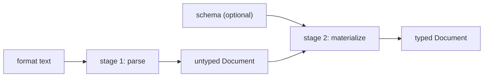

# 7. Codecs and deserialization

## 7.1 Two stages

Reading a document is two separate operations, and keeping them separate is
normative.


```mermaid
graph LR
    text["format text"] --> parse["stage 1: parse"]
    parse --> untyped["untyped Document"]
    schema["schema (optional)"] --> mat["stage 2: materialize"]
    untyped --> mat
    mat --> typed["typed Document"]
```

**C-1. Stage 1: parse.** Turn format text into a Document. No schema is involved. The
result carries whatever types the format itself distinguishes — JSON has no date
type, so an ISO-8601 date arrives as a string. Stage 1 MUST be total with
respect to the schema: it never consults one and never fails because of one.

**Stage 2: materialize.** Walk the untyped Document together with a schema,
upgrading leaves to the declared types, and check record shape in the same pass.

**C-2.** Stage 2 is optional. With no schema, the Document is returned exactly as read,
untouched. There is no third mode. Implementations MUST NOT offer a `strict`
switch: either a schema is supplied and the result is guaranteed to conform, or
one is not and nothing is checked.

**XML is the one documented exception to "stage 1 never consults a schema."**
Every other format Omnist reads has *some* native way to write a typed
literal — JSON/YAML/TOML numbers and booleans, OML/OSD's own grammar — so a
leaf arriving as a string in those formats reflects the author's actual
choice: they wrote a string, not a number, and materialization respects
that (§7.2). XML has no typed-literal syntax at all; `<qty>3</qty>` and
`<sku>3</sku>` are lexically identical, and a reader cannot tell "the
author meant an integer" from "the author meant the string `3`" without
outside information. The schema is the only source of that information XML
has. So: an XML reader given a schema MAY consult it to pre-type a leaf's
text into the scalar kind stage 1 would otherwise have been unable to
produce — using exactly the same value-exact rules §7.2 defines for
materialization (a text leaf becomes `integer`/`number`/`boolean` only when
its text is an exact, unambiguous literal of that kind; anything else stays
a string and is left for the standard stage 2 shape/cardinality check to
accept or reject). This pretyping step is not stage 1 in the sense every
other format's stage 1 is — it exists only because XML's stage 1 has
strictly less information than every sibling format's stage 1 does, and it
never substitutes for stage 2's record-shape and cardinality checking, which
still runs afterward exactly as it does for every other format. Pretyping is a
route into the model like any other, so [D-9](02-document-model.md#24-safety-limits)'s
integer-digit limit binds it ([D-28](02-document-model.md#24-safety-limits)):
a leaf the schema types as `integer` whose text is an integer literal with more
digits than the limit is refused with `document.limit.int-digits` at the
Document path of the leaf (indexed per
[E-10](08-conformance-and-errors.md#84-paths)), as
[E-4a](08-conformance-and-errors.md#832-document-building-and-limits) states. It
does not stay a string for stage 2 to reject as `materialize.inexact-conversion`,
and it does not crash the reader. No other
format gets this exception: a JSON/YAML/TOML/OML/OSD leaf that is a string
after stage 1 stays a string unless stage 2 upgrades it, per §7.2's normal
rule.

**C-11. When a JSON object repeats a key, the last value replaces the earlier
ones, and the surviving edge keeps the position of the key's first
occurrence.** `{"a":1,"a":2}` reads as the single edge `(a,2)`, and a later
value replaces an earlier one whatever the two shapes are: it is not appended
to the earlier value and it is not merged into it. An array value contributes
its elements, as it does anywhere: `{"a":1,"a":[2,3]}` reads as
`[(a,2),(a,3)]` and `{"a":1,"a":[]}` as no `a` edge at all. RFC 8259 says names
within an object SHOULD be unique and defines no result when they are not, so
this is this specification's rule, chosen because it is what the mainstream
JSON parsers already do. It is the same at every depth, and it is not the
array rule: a JSON array under one key is a run of same-label edges
(`{"m":[A,B]}` reads as `[(m,A),(m,B)]`), and a duplicate key is not.

**Where the surviving edge sits.** The edge (or, for an array value, the run of
edges) stands where the key was **first** written among its siblings, and
carries the value of the key's **last** occurrence. `{"a":1,"b":2,"a":3}` reads
as `[(a,3),(b,2)]`, not `[(b,2),(a,3)]`; `{"a":1,"b":2,"a":[3,4]}` reads as
`[(a,3),(a,4),(b,2)]`; `{"a":1,"b":2,"a":[]}` reads as `[(b,2)]`, because the
last value contributes no edge. This is [D-1](02-document-model.md#23-structural-invariants)
applied to a read that collapses: the position a key takes is fixed by where
the text first mentions it, so a later repeat changes the value and never
reorders the siblings, which is also what assigning to an ordered map does in
the mainstream JSON parsers.

C-11 is about JSON. YAML and TOML repeat no key silently: see C-12.

**C-12. A YAML mapping or a TOML table that repeats a key is rejected.** The
read fails with `parse.codec-syntax`
([§8.3.1](08-conformance-and-errors.md#831-parse-text-to-document-stage-1)),
whose `path` is a text position ([E-11](08-conformance-and-errors.md#84-paths),
[E-31](08-conformance-and-errors.md#84-paths)), and no Document is produced.
This is the opposite of C-11, and for a reason: RFC 8259 only advises that
JSON names be unique, so a reader has a result to choose, whereas YAML (1.1
and 1.2) requires the keys of a mapping to be unique and TOML forbids defining
a key twice, so the input is malformed in its own format and a lenient
reader is the outlier, not the norm. The rule is the same at every depth and
in every style (YAML block and flow mappings, TOML tables and inline tables).
Keys are compared as strings, byte for byte
([D-16](02-document-model.md#25-encoding)): `a` and `"a"` are one key,
and two keys that differ only in Unicode normalization are two. The same key in
two different mappings or tables is not a repeat, and a key a YAML merge key
(`<<`) supplies is not a repeat of the same key written in the mapping itself:
the mapping's own entry overrides the merged one, as
[§ YAML](formats/yaml.md) states for key collisions. For TOML, what counts as
defining a key twice is TOML's own rule, dotted keys and inline tables
included.

**C-13. A YAML `!!pairs`, `!!omap` or `!!set` collection is rejected.** A YAML
input holding a node explicitly tagged `!!pairs`, `!!omap` or `!!set`
(`tag:yaml.org,2002:pairs`, `:omap`, `:set`), whatever its content, is
rejected with `parse.codec-syntax` and a text position, like any input the
codec cannot accept. The three tags describe collections that the Document
model has two readings for: the plain sequence of single-entry mappings (or the
plain mapping of null values) the text is, and the keyed-set or ordered-map
shape the tag names. The ports read them four different ways, and none of the
shapes is needed to read a configuration file, so the rule removes the choice
rather than making it. This rule is about those three tags only: every
other tag keeps the reading it already has, and what an explicitly tagged `<<`
is, is [D-27](02-document-model.md#241-bounding-alias-expansion)'s.

## 7.2 Materialization rules

Materialization upgrades a leaf **only when the conversion is value-exact.**

| From | To | Upgraded? |
|---|---|---|
| `"2024-01-01"` | `date` | Yes |
| `"12:30:00"` | `time` | Yes |
| `"2024-01-01T12:30:00"` | `datetime` | Yes |
| `1.0` | `integer` | Yes — value-exact |
| `1.5` | `integer` | No. Error. |
| `1` | `number` | Yes |
| `"1"` | `integer` | No. Error. A string is not a number. |
| `"maybe"` | `boolean` | No. Error. |

The rule is one sentence: a conversion is permitted when it loses nothing and
invents nothing. String-to-number coercion invents; float-to-int truncation
loses. Neither happens.

**A `number`-typed field always materializes to a host float, never a
host integer** — regardless of whether the source value looked whole. `1 ->
number` yields a float-typed `1.0`, not an integer-typed `1`, even though
both represent the same value exactly. This is the reverse direction of the
`1.0 -> integer` row above, and it's easy to miss since the table shows the
result as `Yes` without stating the target representation explicitly.

At an `any`-typed field, materialization stops. The subtree passes through
untouched and no leaf beneath it is upgraded.

**C-3.** Materialization MUST collect **every** problem it finds, not stop at the first,
and report them together. Each entry carries a path, a code, and a message. See
[chapter 8](08-conformance-and-errors.md).

> Materialization cannot be implemented as "validate, then convert."
> `validate` checks a value already in its final form and has no notion of
> upgrading. Since materialization already knows, at every node, which field and
> type the schema expects there, upgrading and shape-checking happen in one pass.

### 7.2.1 `materialize(node, schema)` — pseudocode

**C-4.** Structurally this is [§3.6.1](03-schema-model.md#361-validatedocument-schema-pseudocode)'s
`validate` with every leaf replaced by its upgrade result instead of discarded.
The two MUST stay in lockstep: whatever this function accepts at a leaf,
`validate` must also accept there, and vice versa. They are two different
projections of the same rule, not two independently tuned rules that happen to
agree today.

```
function materialize(node, S):
    result = ValidationResult()
    out = materialize_type(node, S, S.root, "$", result)
    if not result.ok:
        fail with every entry in result           # collect-all, not fail-fast
    return out

function materialize_type(node, S, t, path, result):
    d = S.resolve(t)
    if d is Any:
        return node                                # untouched; nothing beneath upgraded
    if d is Scalar:
        return materialize_scalar(node, d, path, result)
    return materialize_record(node, S, d, path, result)

function materialize_record(node, S, rec, path, result):
    if node is a leaf:
        result.add(path, "shape-mismatch", "expected an object, got a value")
        return node                                 # unchanged; caller will fail on result
    out = []
    counts = {}
    for (label, child) in node.edges:
        counts[label] = counts.get(label, 0) + 1
    seen = {}
    for (label, child) in node.edges:
        i = seen.get(label, 0)
        seen[label] = i + 1
        child_path = path + "." + label + (("[" + i + "]") if counts[label] > 1 else "")
        f = rec.field(label)
        if f is none:
            result.add(child_path, "unexpected-field", "field not declared on this record")
            append (label, child) to out            # kept as-is; not dropped
        else:
            append (label, materialize_type(child, S, f.type, child_path, result)) to out
    for f in rec.fields:
        c = counts.get(f.label, 0)
        if c < f.min or not le(c, f.max):
            result.add(path, "cardinality",
                        "field " + f.label + " occurs " + c + " time(s), "
                        + "expected [" + f.min + "," + f.max + "]")
    return out

function materialize_scalar(value, s, path, result):
    if value is a node:
        result.add(path, "shape-mismatch", "expected a " + s.kind + " value, got an object")
        return value
    if value is null:
        if not s.nullable:
            result.add(path, "null-not-allowed", "null not allowed here")
        return value                                 # null is never converted further
    upgraded = try_upgrade(value, s.kind)             # value-exact only; see table above
    if upgraded is defined:
        return upgraded
    result.add(path, "type-mismatch",
                "cannot be read as " + s.kind + " (not a value-exact conversion)")
    return value                                       # unchanged; caller will fail on result

function try_upgrade(value, kind):
    # boolean is never treated as an integer or a number, in either direction,
    # even though some host languages consider bool a subtype of int.
    if kind == "string":   return value if value is a string else undefined
    if kind == "boolean":  return value if value is a boolean else undefined
    if kind == "integer":
        if value is an integer:                    return value
        if value is a float and value is integral:  return int(value)
        return undefined
    if kind == "number":
        if value is an integer or a float:          return float(value)
        return undefined
    if kind in {"date", "time", "datetime"}:
        # value MUST already be in the exact spelling matches_kind() accepts
        # for this kind (chapter 4, docs/formats/) -- not merely parseable by a
        # looser library function. A bare date string never upgrades to
        # datetime and vice versa; the two shapes are disjoint by construction.
        if value is a string and value matches kind's ISO spelling exactly:
            return parse(value, kind)
        return undefined
    return undefined
```

`counts` is taken over the whole node before any child is visited, so a
label that occurs more than once is indexed on **every** occurrence, the
first included (`$.n[0]`, `$.n[1]`), and a label that occurs once carries no
index (`$.n`), whatever the schema declares for it
([§8.4](08-conformance-and-errors.md#84-paths), E-10). The same rule builds
the paths of `validate` ([§3.6.1](03-schema-model.md#361-validatedocument-schema-pseudocode)).

**Materialization never invents and never loses.** `1.0 -> integer 1` is
value-exact; `1.5 -> integer` is not, and is an error, not a truncation.
`"1" -> integer` is not attempted at all: a string is never upgraded to a
numeric kind by this stage regardless of its contents, because doing so
would make materialization behave differently depending on which format
produced the untyped Document, and format-independence (§2.1) is not
optional. **This is the general rule for every leaf that reached stage 2
still a string because its source format could have written something
else and didn't.** It does not apply to a leaf XML's schema-aware pretyping
already converted before this stage ran (§7.1's documented exception) —
that pretyping used these exact value-exact rules itself, at the one point
where a format has no other way to signal type at all. By the time stage 2
runs, an XML-sourced leaf that's still a string is a string for the same
reason any other format's is: nothing pretyped it, so §7.2 treats it
identically to a JSON/YAML/TOML/OML/OSD string. There is no second,
looser numeric-coercion path inside stage 2 itself, for any format.

Everything under an `any` field is skipped by `materialize_type`'s first
branch, at every depth — an `any` field one level deep and one a hundred
levels deep behave identically: nothing beneath either is inspected.

## 7.3 Writing

Writing is the reverse projection, and it is **schema-free by design**.

**C-5.** A writer MUST NOT accept a schema. Its job is to serialize the Document exactly
as it is. Schema awareness is one-directional, on the read side only.

**C-6. Grouping.** Edges sharing a label are grouped into one key, regardless of
position: `[(m,A),(x,X),(m,B)]` writes as `{"m":[A,B], "x":X}`. Within-label
order is preserved. Cross-label interleaving is lost, because no format in the
JSON family (JSON, YAML, TOML) can express it — only OML and XML preserve it —
and a writer that loses it MUST report `format.interleaving-lost`
([§8.3.8](08-conformance-and-errors.md#838-format-codec-adjustments)).

**C-7. The count-1 rule.** A label appearing exactly once MUST be written as a bare
value. A label appearing more than once MUST be written as a list. This is
forced: a one-element list and a single value are the same Document — one edge —
so the Document alone cannot tell them apart, and the writer has no schema to
ask.

That asymmetry is real and worth stating outright. `{"tag": ["x"]}` reads to one
edge and writes back as `{"tag": "x"}`. The Document is unchanged; the text is
not.

### 7.3.1 `write(node, format)` — pseudocode

Both rules above, formalized to match the pseudocode style used everywhere
else in this spec:

```
function write(node, format):
    if node is a leaf:
        return format.render_scalar(node.value)

    groups = ordered_map()                    # label -> list of children, first-seen order
    for (label, child) in node.edges:
        groups[label].append(child)

    out = ordered_map()
    for (label, children) in groups:
        if len(children) == 1:
            out[label] = write(children[0], format)      # bare value
        else:
            out[label] = [write(c, format) for c in children]  # list

    return format.render_node(out)
```

**C-8.** `groups` MUST preserve first-seen label order (the order §7.3's grouping rule
already requires) and, within a label, the children's original edge order.
Neither rule above is new; this section only gives them a pseudocode form
consistent with `validate` (§3.6.1), `materialize` (§7.2.1), and the schema
algebra (chapter 6) — there is no ambiguity being resolved here, only a
presentational gap being closed.

**C-9. A writer MUST fail on a string that does not encode to valid UTF-8, a
value or a label, in every format.** The JSON, YAML, TOML, XML and OML writers
MUST each fail with `write.unsupported-value`
([§8.3.9](08-conformance-and-errors.md#839-write)) when the Document holds a
string, as a leaf's value or as an edge's label, that has no UTF-8 encoding.
That is a **UTF-16 lone surrogate** in a language whose strings are sequences
of UTF-16 code units (Python, TypeScript, Java), a **surrogate-escape
artefact** (`U+DC80`..`U+DCFF` from Python's `errors="surrogateescape"`), and a
byte sequence that is not well-formed UTF-8 in a language whose string is
bytes (Go). The failure is unconditional, regardless of `strict`, on the rule
[E-6](08-conformance-and-errors.md#838-format-codec-adjustments) states for
every writer case of this shape: a writer that cannot represent a value fails
rather than emit something else. That is the "fail, don't invent" principle
the spec already applies to labels a format cannot spell
([E-6](08-conformance-and-errors.md#838-format-codec-adjustments),
[OSD-14](05-osd-grammar.md#59-canonical-output)) and to a schema label with no
UTF-8 encoding ([S-22](03-schema-model.md#33-formal-definition)). Here the
alternatives to failing are text no UTF-8 sink accepts, or a repair (`U+FFFD`,
`?`, dropping the edge) that reads back as a different Document, which is the
silent repair [D-14](02-document-model.md#25-encoding) forbids on the read
side. A language whose string type cannot hold such a string (Rust's `String`)
meets the rule vacuously.

Three points keep the rule narrow:

- **Spelling it is not complying.** A writer that emits a lone surrogate as an
  escape (`"\ud800"` in JSON, YAML or TOML) has still represented the value,
  and C-9 forbids it all the same: TOML and YAML do not permit a surrogate
  escape, and a JSON reader in a language whose strings are scalar values
  replaces or rejects it, so the text does not read back as the Document it
  came from. Only a failure complies.
- **The path is the Document path of the node holding the string.** For a
  value that is the leaf (`$.a`, `$.item[1]`, indexed per
  [E-10](08-conformance-and-errors.md#84-paths)). For a label it is the node
  that holds the *edge*, not the edge: §8.4 has no way to quote a label, and
  the label is precisely what has no encoding, so the field form would put the
  unwritable string into a byte-compared path, the same reasoning as
  OSD-14's record path. A string beneath an edge whose own label has no
  encoding is reported at the holder of that edge too, for the same reason.
  A writer MAY stop at the first such string it finds.
- **Readers are untouched.** [D-14](02-document-model.md#25-encoding) still
  says a string-typed entry point may accept such a string. C-9 is about
  emitting it: the Document may hold the string, no writer may write it.

No vector pins C-9. A vector's input is UTF-8 text or `bytes_hex`
([E-27](08-conformance-and-errors.md#853-operation-drivers)), and a Document
carrying a lone surrogate arrives from neither: text containing one is not
valid UTF-8, and bytes that decode to one are a D-14 `parse.invalid-encoding`.
Adoption is tracked under `DIV-5`
([§9.4](09-divergence-ledger.md#94-known-open-divergences)).

**C-10. An XML writer MUST fail on a null leaf.** The XML writer MUST fail
with `write.unsupported-value`
([§8.3.9](08-conformance-and-errors.md#839-write)), unconditionally and
regardless of `strict`, when the Document holds a leaf whose value is null.
The `path` is the Document path of that leaf, indexed per
[E-10](08-conformance-and-errors.md#84-paths). XML has no null token. The one
spelling a writer could reach for is the empty element, `<a/>`, and the
[XML read rule](formats/xml.md#model-mapping) makes an element with no child
elements a string leaf holding its text, so `<a/>` reads back as the empty
string `""`. A written null would then be indistinguishable from the different,
valid Document that holds `""` there, which is the collision
[E-6](08-conformance-and-errors.md#838-format-codec-adjustments) fails on
instead of adjusting. This is the rule TOML already follows for its null
([TOML](formats/toml.md#model-mapping)); JSON, YAML and OML spell null natively
and are unaffected. No `format.*` code is involved: a writer MUST NOT emit an
empty element for the null, and MUST NOT report the write as an adjustment.
An empty string leaf is not a null leaf and still writes as `<a/>`. A writer
MAY stop at the first null leaf it finds.

## 7.4 Format reports

A reader or writer SHOULD be able to report the adjustments a given conversion
would make — a temporal value stringified, a non-string scalar stringified,
cross-label interleaving lost — without performing it. This is what makes
lossiness auditable ahead of time rather than discovered afterward.

The report's contents are format-specific. Its codes belong to the `format.*`
family in [§8.3.8](08-conformance-and-errors.md#838-format-codec-adjustments),
which is new material and which no implementation currently emits. Note that
not every `format.*`-adjacent behavior belongs in this report: a value that
`format.*` now rejects outright as `write.unsupported-value` (§8.3.9) —
an illegal-character label, an unrepresentable null, a special float, an
empty internal node, a string with no UTF-8 encoding (C-9) — is a write
**failure**, not a lossy-but-successful
adjustment, so it has nothing to preview here.

## 7.5 Per-format pages

The format-by-format mappings that used to sit here as §7.4-7.8 now live in
`docs/formats/`, one page per format. Each page states that format's mapping to
and from the Document model and its current per-implementation parity gaps.

| Page | Covers |
|---|---|
| [Format overview](formats/overview.md) | The index, and what each format can and cannot express |
| [JSON](formats/json.md) | Objects, keyed lists, no temporal types, no `NaN` |
| [YAML](formats/yaml.md) | Mappings, sequences, aliases, resolver-typed scalars |
| [TOML](formats/toml.md) | Tables, array-of-tables, native temporals, no `null` |
| [XML](formats/xml.md) | Elements, interleaving, dropped attributes and namespaces |
| [OML](formats/oml.md) | The native format; the Document model as syntax |
