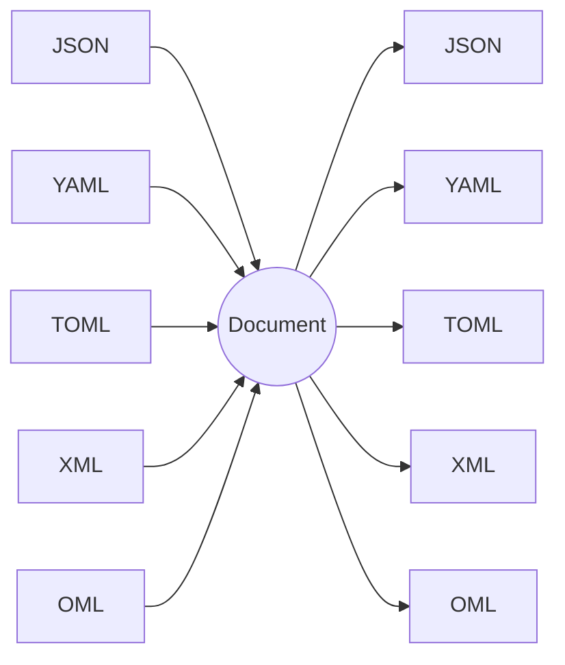

# Format codecs: overview

Every format reads into, and writes back out from, the same Document model of
[chapter 2](../02-document-model.md). There is no per-format model and no
per-format schema dialect. Conversion is read one format, write another; what
survives the trip is exactly what both formats can express, and where they
cannot, the loss is stated on the format's own page rather than discovered at
runtime. The two-stage read pipeline (parse, then optionally materialize
against a schema) is the same for all five and is defined in
[chapter 7](../07-codecs-and-deserialization.md).



## The five formats

| Format | Good at | Cannot express |
|---|---|---|
| [JSON](json.md) | The baseline. Universally available, unambiguous scalar syntax, many top-level keys. | Temporal types, `NaN`/`Infinity`, cross-label interleaving, bare nested arrays. |
| [YAML](yaml.md) | Readable nesting, aliases, and a resolver that types dates without a schema. | Standalone time-of-day (a bare `12:00:00` becomes an integer), cross-label interleaving, shared identity across an alias. |
| [TOML](toml.md) | Native `date`, `time`, and `datetime` literals in both directions. `[[table]]` is the repeated label, written idiomatically. | `null`, a non-table top level, cross-label interleaving. |
| [XML](xml.md) | Repeated and interleaved elements in original order — the shape the Document model was built around. | Typed leaves (all text is string), several top-level edges, and — in the current profile — attributes and namespace prefixes. |
| [OML](oml.md) | Every Document shape, with zero adjustments: any nesting, any repeated label, any interleaving. | Temporal literals; a temporal value writes as a string and needs a schema to read back. |

## Per-format pages

Each page has two sections: **Model mapping**, which is normative, and
**Parity gaps**, which reports the current implementation status for that
format and defers to [chapter 9](../09-divergence-ledger.md) as the authority.

- [JSON](json.md)
- [YAML](yaml.md)
- [TOML](toml.md)
- [XML](xml.md)
- [OML](oml.md)

## The running example

Every page maps the same schema and the same Document, so the format pages can
be read side by side.

```
record Address  { "street": string, "city": string }
record LineItem { "sku": string, "qty": integer, "price": number }

record Order {
    "id":           string,
    "status":       string,
    "total":        number,
    "address":      Address,
    "items" [1,]:   LineItem,
    "coupon" [0,1]: string,
}

record Root { "order": Order }
root Root
```

The Document, as an edge list:

```
[ (order, [ (id,      "A1"),
            (status,  "shipped"),
            (total,   29.97),
            (address, [ (street, "1 Main"), (city, "London") ]),
            (items,   [ (sku, "W"), (qty, 3), (price, 9.99) ]),
            (items,   [ (sku, "G"), (qty, 1), (price, 9.99) ]) ]) ]
```

The order sits under a single top-level `order` key so that the identical
Document survives every format, XML included: an XML document has exactly one
top-level element, so a Document with several top-level edges cannot be written
as XML at all.

## Beyond the running example

The schema above is clean on purpose — it demonstrates the model without
tripping any of the gaps in the table above. [`../examples/`](../examples/index.md)
in this repository goes a step further: four real external formats — a
`package.json`, a `pyproject.toml`, a GitHub Actions workflow, and a
`sitemap.xml` — each modeling a format nobody designed for Omnist, and each
hitting a real limit: unions, an open key set, a codec-level surprise, and
a value refinement OSD can't express. Each of the four per-format pages
below links the one that's most relevant to it.
