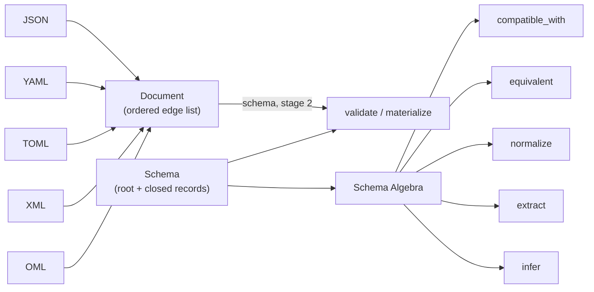

# Omnist Specification, v0.2

Project home: [omnist.dev](https://omnist.dev)

## Abstract

Omnist is a data-modeling system built on one small formalism. A **Document** is
an ordered list of labeled edges. A **Schema** is a graph of named, closed
records constraining those edges. Because both models are small and closed, a
set of operations over schemas — inclusion, equivalence, minimization,
extraction, inference — are decidable and total, not best-effort.

This specification defines:

1. the Document model, and the invariants every implementation must preserve;
2. the Schema model, and what it deliberately cannot express;
3. **OML**, the text format for Documents;
4. **OSD**, the text format for Schemas;
5. the **Schema Algebra**: the operations over schemas and their exact semantics;
6. the ingestion pipeline that turns JSON, YAML, TOML, and XML into Documents;
7. a conformance protocol and error taxonomy.

The target is byte-identical conformance results across independent
implementations. Where a rule is underspecified, that is a defect in this
document, not license to choose.

## Key principles

**One model, many formats.** JSON, YAML, TOML, XML, and OML all read into the
same Document. Conversion is read-one, write-another. No format-specific model
exists.

**Repeated labels are the array.** There is no array type in the Document model
and no array type in the Schema model. `{"tag": ["x","y"]}` is the label `tag`
occurring twice. This is what lets XML's interleaving survive the round trip
that a map-of-arrays would destroy.

**Order is data, never a constraint.** A Document preserves edge order because
it is a faithful record of its input. Schema validation ignores order entirely;
only counts matter.

**Closed by default, open only where written.** Records name every label they
allow. Scalar types are never composed. There are no maps, no wildcard keys, no
unions, no enums. The single opening is the `any` type, which is visible in the
schema text at a fixed label.

**Decidability is the constraint that shapes the rest.** Every refusal in this
spec exists to keep the Schema Algebra total and exact. A feature that would
force an operation to answer "maybe" is not added.

## Relationship to prior work

The Schema Algebra descends from Lee and Cheung, *XML Schema Computations*
(CIKM 2010). Omnist generalizes the paper in one direction and simplifies it in
three. Chapter 6 states the deltas precisely; that is the right place to read
them, since they only matter once the operations are on the table.

## Keywords

The key words **MUST**, **MUST NOT**, **REQUIRED**, **SHALL**, **SHALL NOT**,
**SHOULD**, **SHOULD NOT**, **RECOMMENDED**, **MAY**, and **OPTIONAL** in this
specification are to be interpreted as described in
[RFC 2119](https://www.rfc-editor.org/rfc/rfc2119) and
[RFC 8174](https://www.rfc-editor.org/rfc/rfc8174), and only when they appear in
all capitals.

Text in blockquotes, and any section marked *Non-normative*, is commentary. It
explains reasoning and does not impose requirements.

## Implementations

Five official ports, all built against this specification. Version and
maturity are as of the current [divergence ledger](09-divergence-ledger.md)
revision — read it for exact conformance numbers, test coverage, and
per-port audit notes; this table is a summary, not the source of truth.

| Language | Version | Maturity | Docs |
|---|---|---|---|
| [Python](https://github.com/omnist-dev/omnist) | 0.8.4 | beta, reference implementation | [py.omnist.dev](https://py.omnist.dev) |
| [TypeScript](https://github.com/omnist-dev/omnist-ts) | 0.1.1-alpha | alpha | [ts.omnist.dev](https://ts.omnist.dev) |
| [Rust](https://github.com/omnist-dev/omnist-rs) | 0.2.0-alpha | alpha | [rs.omnist.dev](https://rs.omnist.dev) |
| [Go](https://github.com/omnist-dev/omnist-go) | 0.2.0-alpha | alpha | [go.omnist.dev](https://go.omnist.dev) |
| [Java](https://github.com/omnist-dev/omnist-j) | 0.2.0-alpha | alpha | [j.omnist.dev](https://j.omnist.dev) |

**Python** is the reference implementation — the oldest and most complete
port, and the tie-breaker of last resort when this spec's prose is
ambiguous.

**TypeScript**, **Rust**, **Go**, and **Java** are independent, spec-first
ports: each is built from this document alone, consulting sibling ports'
source only as a narrow, after-the-fact tie-breaker once a spec gap is
already filed, never as a primary source. Every gap one of them hits by
that process is treated as a defect in this spec to fix, not a
port-specific note — see [§9.5](09-divergence-ledger.md) for the full
policy.

## Reading order

| Chapter | Read it for |
|---|---|
| [01 Glossary](01-glossary.md) | Terms used everywhere else |
| [02 Document model](02-document-model.md) | The data structure |
| [03 Schema model](03-schema-model.md) | The constraint structure |
| [04 OML grammar](04-oml-grammar.md) | Writing Documents as text |
| [05 OSD grammar](05-osd-grammar.md) | Writing Schemas as text |
| [06 Schema Algebra](06-schema-algebra.md) | The operations |
| [07 Codecs](07-codecs-and-deserialization.md) | Reading other formats |
| [08 Conformance and errors](08-conformance-and-errors.md) | Passing the test suite |
| [09 Divergence ledger](09-divergence-ledger.md) | What implementations may differ on |
| [10 Governance](10-governance-and-versioning.md) | How this document changes |
